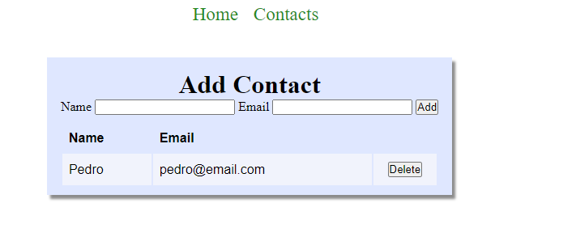
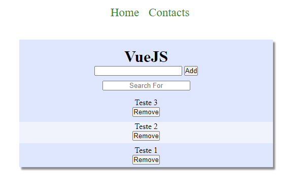
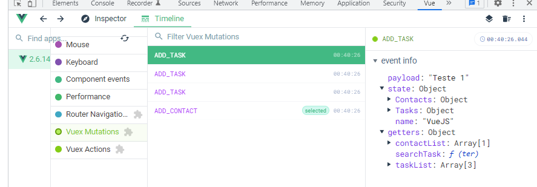

# Lista de Tarefas / Lista de Contados (Vuex)

Projeto feito durante o estudo sobre Vuex.

Nele é possivel adicionar/remover e pesquisar por tarefas.

Adiconar/Remover um contato.

Neste projeto é possivel realizar o controle dos estados das ações através do Vuex.

Foi utilizado no projeto:

Vuex
Vue Rotas

---






---

``` bash
# install dependencies
npm install

# serve with hot reload at localhost:8080
npm run dev

# build for production with minification
npm run build
```

For detailed explanation on how things work, consult the [docs for vue-loader](http://vuejs.github.io/vue-loader).
